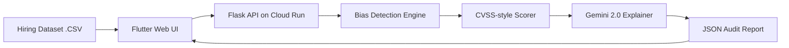

# FairHire — AI Bias Vulnerability Auditor

> **"Fixing the system, not the student."**

FairHire is India's first AI-driven vulnerability auditor for hiring datasets. It identifies algorithmic biases in selection processes—specifically targeting Institutional Pedigree, Socio-Cultural Identity, and Geographic Access—and provide AI-powered remediation plans using Gemini 2.0.

## 🔴 The Problem
Over 1.5 million engineering graduates enter the Indian job market annually. Most screening is handled by "Black Box" AI systems that often harbor unconscious biases based on college tiers, name-based cultural indicators, and location. Companies want to be fair, but they lack the tools to audit their own algorithms.

## 🟢 The Solution
FairHire acts as a "Security Scanner" for HR. By uploading a hiring dataset, organizations get a professional-grade **Audit Report** with:
- **CVE-style Findings**: Unique identifiers (e.g., `IN-BIAS-2025-0001`) for every bias pattern.
- **Bias Fingerprint**: A Radar chart visualizing the organizational bias profile.
- **Gemini Remediation**: Actionable, AI-generated fixes to mitigate detected biases.

## 🛠 Tech Stack
- **Frontend**: Flutter Web (Material 3, fl_chart, Google Fonts)
- **Backend**: Python Flask (Pandas, NumPy, Flask-CORS)
- **AI Layer**: Gemini 2.0 Flash (Multi-model fallback & Rule-based fallback)
- **Deployment**: Google Cloud Run (Backend) & Firebase Hosting (Frontend)

## 🏗 Architecture

## 🚀 Getting Started

### Backend
1. `cd backend`
2. `pip install -r requirements.txt`
3. `python app.py`

### Frontend
1. `cd flutter_app`
2. `flutter pub get`
3. `flutter run -d chrome`

## 👥 Team
- **Backend Lead**: [Your Name]
- **Frontend Lead**: [Teammate Name]
- **Data & AI**: [Teammate Name]
- **DevOps**: [Teammate Name]

---
*Created for the Hack2Skill Prototype Submission — April 2026*
